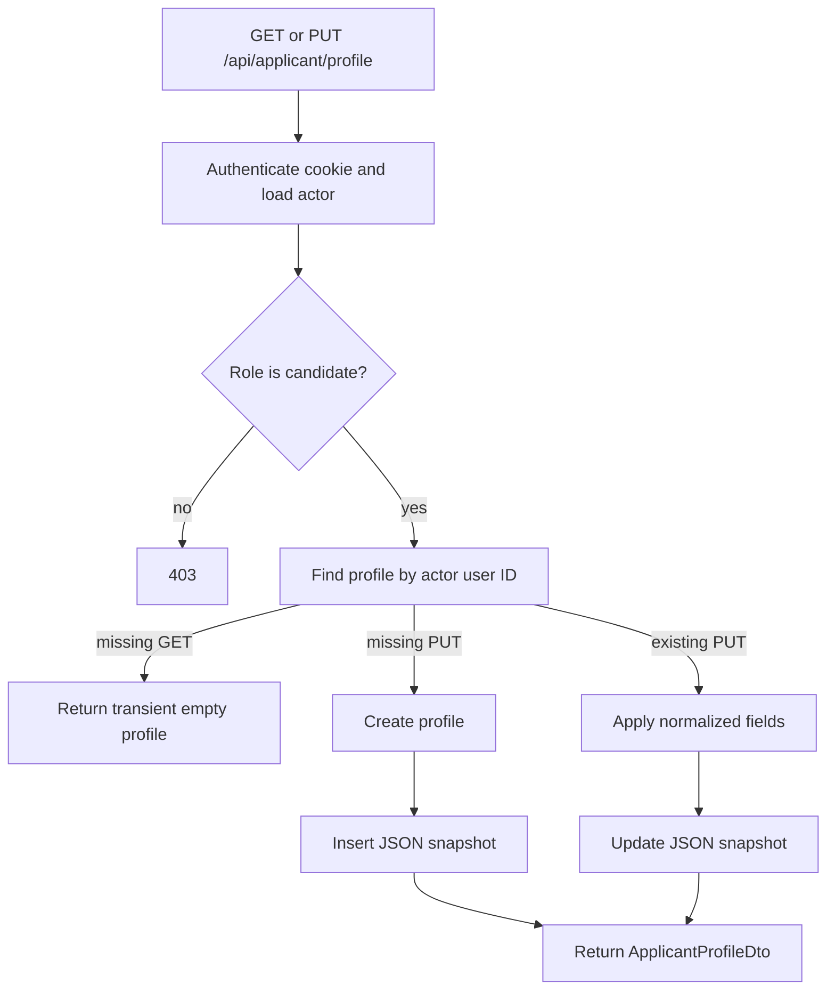
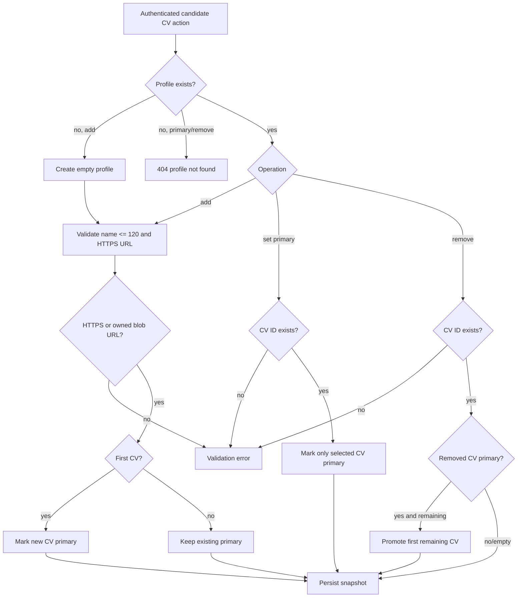
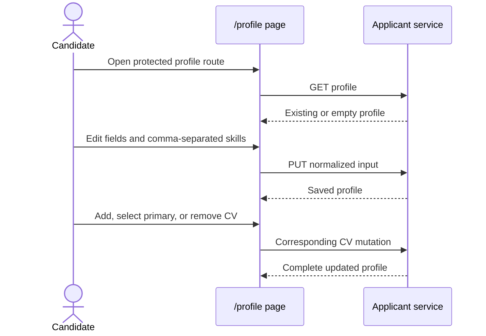

# Applicant Profiles And CV Library

Last updated: main@4ca0f29 | 2026-09-15

## Scope

This spec covers `Domain/Applicants/CandidateProfile.cs`, `Application/Applicants/ApplicantProfiles.cs`, `Api/Endpoints/Applicants/ApplicantProfileEndpoints.cs`, applicant-service route ownership, `applicant_profiles` persistence, Angular `pages/applicant-profile.ts`, and matching client models/calls.

## Business Requirements

- Only a candidate may own and manage an applicant profile.
- A candidate can maintain a headline, summary, location, phone, normalized skills, and multiple named CV links.
- CV references may be absolute HTTPS links or authenticated owner-scoped `/api/blobs/{id}` links from the generic blob service.
- Exactly one CV is primary whenever the library is nonempty.
- A profile read before first save must return an empty in-memory profile rather than fail.
- Every mutation is scoped to the authenticated candidate ID; callers cannot select another candidate ID.

## Profile Read And Update Flow

Headline and location are trimmed and limited to 160 characters; summary is trimmed and limited to 2,000. Blank phone input removes the phone. Nonblank phone input is normalized through `PhoneNumber`. Skills are normalized by the shared skills value logic. Every update refreshes `UpdatedAt` in UTC.

A missing profile is persisted only on mutation. Therefore repeated GETs before a save produce newly timestamped transient DTOs and no row.

## CV Library Flow

Routes are `POST /api/applicant/profile/cvs`, `POST /api/applicant/profile/cvs/{cvId}/primary`, and `DELETE /api/applicant/profile/cvs/{cvId}`. CV IDs are generated server-side. Duplicate IDs are rejected by the aggregate, although clients cannot supply IDs on add.

## User Interface Flow

The Angular page supports native document file selection. It uploads raw bytes to the generic blob service with purpose `candidate-cv`, then links the returned URL to the profile; failure to link triggers best-effort compensating deletion. The Angular route uses only the generic auth guard. Staff can navigate to it but receive a server-side 403. The header conditionally presents the profile link for candidates; this is convenience, not enforcement.

## Personal Data And Ownership

Profile fields, phone number, skill history, and CV URLs are personal data. External CV URLs may grant access outside Hirelane. Blob URLs require the owning candidate's authenticated cookie and are not public. Current recruiter application DTOs carry a separately supplied resume URL; the primary profile CV is not automatically attached to applications.

## Current Gaps

- Uploaded CV blobs are owner-access-controlled but are not scanned, expired, transformed, or shareable with recruiters; external URL confidentiality still depends on the external host.
- Applicant profiles cannot be viewed by recruiters, even for an application.
- Applying does not default to or reference the primary profile CV.
- No optimistic concurrency token prevents lost updates from concurrent sessions.
- UI primary/remove actions lack confirmation and local error handling.
- Tests cover primary selection and HTTPS rejection but not all profile limits, phone normalization, deletion promotion, authorization, or persistence.
