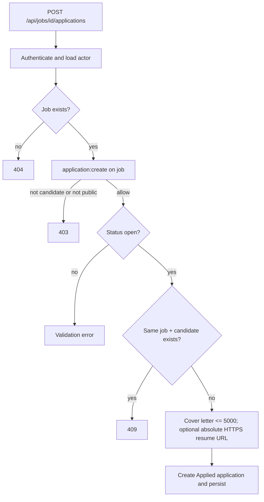
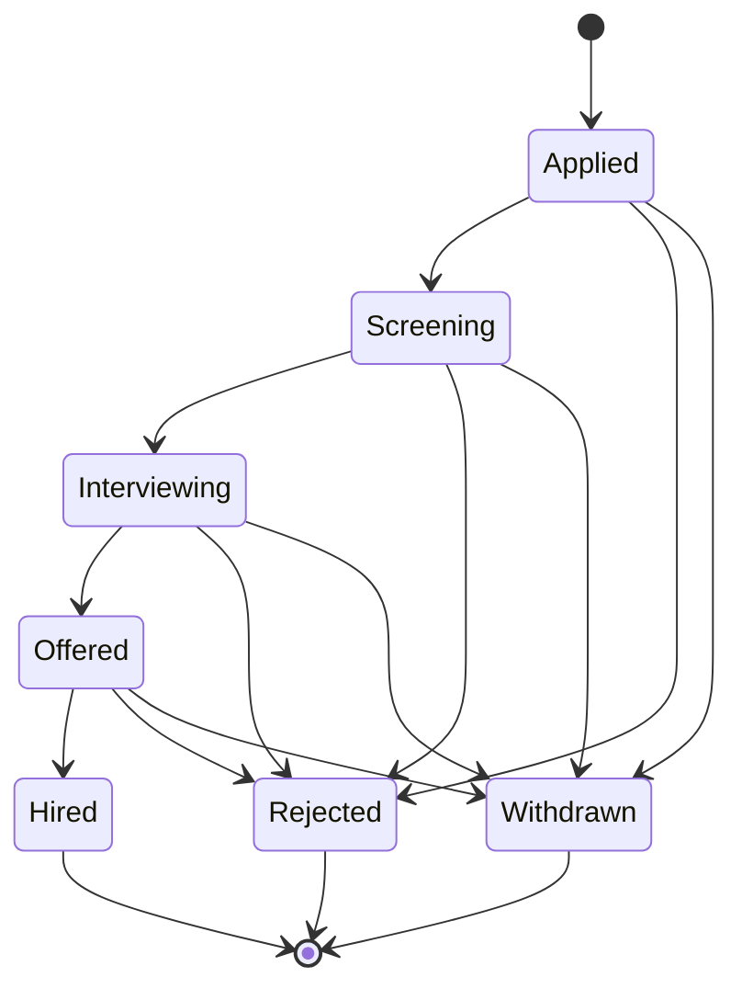
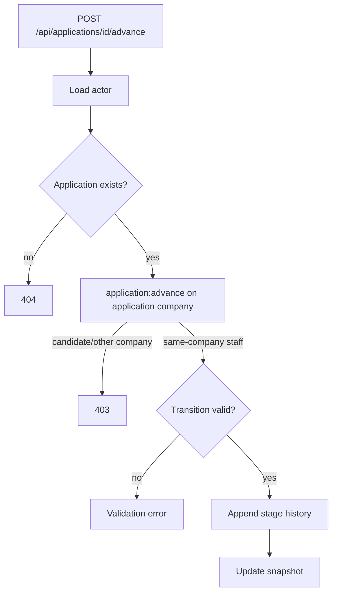
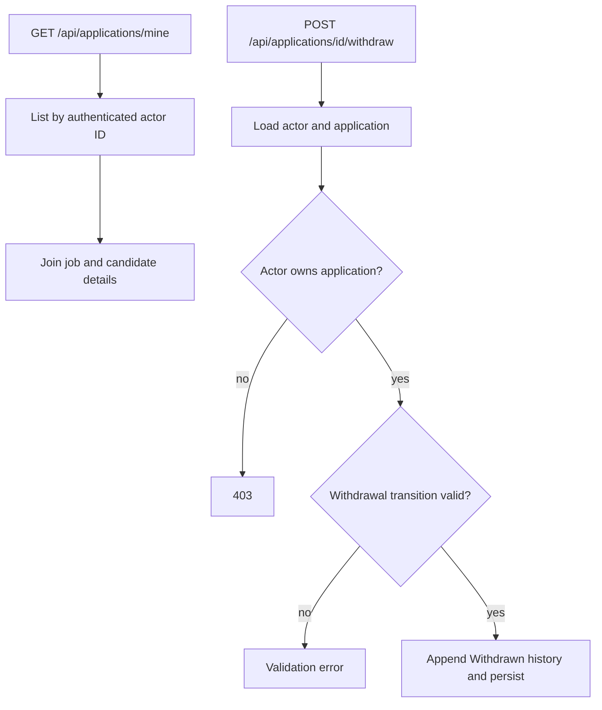
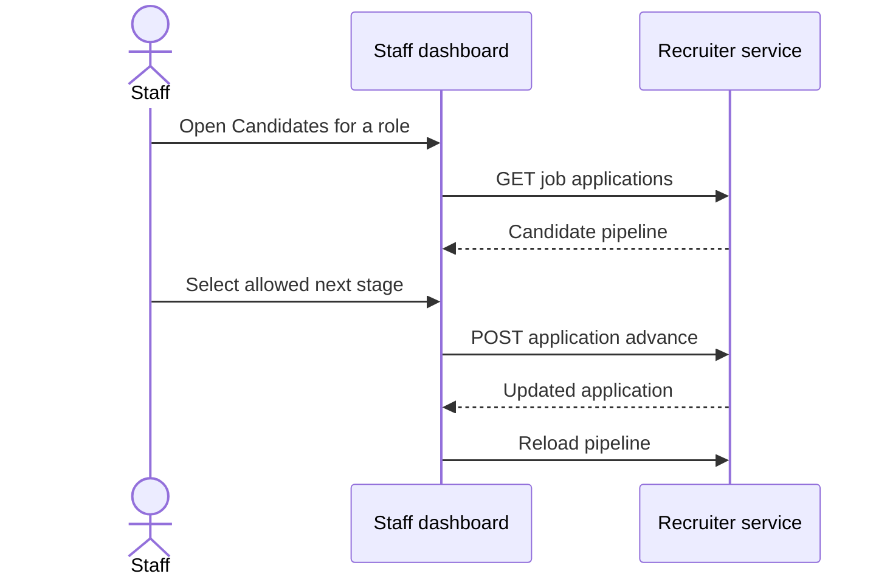

# Applications And Hiring Pipeline

Last updated: main@4ca0f29 | 2026-09-15

## Scope

This spec covers `Domain/Applications/JobApplication.cs`, `Application/Applications/Applications.cs`, application endpoints, applicant/recruiter service ownership, repository indexes, and candidate/staff dashboard flows.

## Business Requirements

- Only an authenticated candidate may apply to a currently open job.
- A candidate may apply to a given job at most once.
- Company staff may read and progress only applications belonging to their company.
- Candidates may read and withdraw only their own applications and may never advance themselves.
- Pipeline movement must be sequential, except staff may reject and candidates may withdraw from any nonterminal stage.
- Every successful stage change must record actor, previous/new stage, optional note, and UTC timestamp.
- Private application existence should be hidden from unauthorized readers where implemented.

## Apply Flow

The database also has a unique `(JobId, CandidateId)` index. The handler checks first for a friendly conflict, while the index is the final concurrent-write guard. There is no idempotency key; concurrent duplicate requests may surface as an unhandled database conflict rather than the domain conflict.

## Pipeline State Machine

Staff `Advance` cannot target `Withdrawn`; candidates must use `Withdraw`. The aggregate rejects skipped, backward, repeated, and terminal transitions. Staff notes are trimmed, optional, and limited to 2,000 characters. `ApplicationDto.NextStages` exposes valid staff moves and excludes withdrawal.

## Staff Progression Flow

## Candidate Tracking And Withdrawal

`ListMyApplications` scopes directly by claim ID but does not explicitly reload or validate that the actor is a candidate. A valid cookie for staff simply returns any applications whose candidate ID equals that staff ID, normally none.

## Recruiter Reads

`GET /api/jobs/{jobId}/applications` requires same-company `application:read`. `GET /api/applications/{id}` permits the owning candidate or same-company staff; denial is mapped to 404 for this single-item read. DTOs include candidate name/email, cover letter, resume URL, stage, next stages, full history, and job title.

## Personal Data

Applications expose candidate identity, email, cover letter, resume URL, and decision history. These are visible to the candidate owner and same-company staff under application read policy. Stage notes may contain sensitive hiring rationale and are returned with the application DTO.

## Current Gaps

- No consent/retention/deletion/export policy exists for applicant personal data.
- Stage history has no event ID and snapshots have no optimistic concurrency token; simultaneous transitions can lose updates.
- Database uniqueness violations from racing apply requests are not translated to 409.
- Staff roles are not differentiated for pipeline permissions; recruiter, hiring manager, and org admin receive equivalent same-company access.
- There is no offer artifact, rejection reason taxonomy, communication workflow, source tracking, or application reopening.
- The candidate dashboard timeline treats rejected/withdrawn as outside the linear stage list and has limited error handling.
