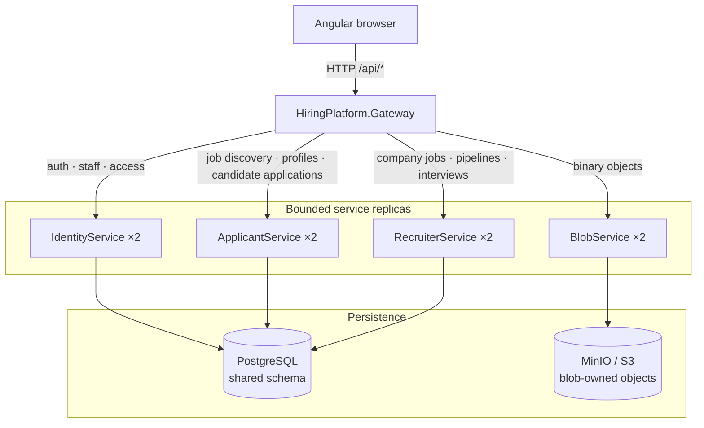
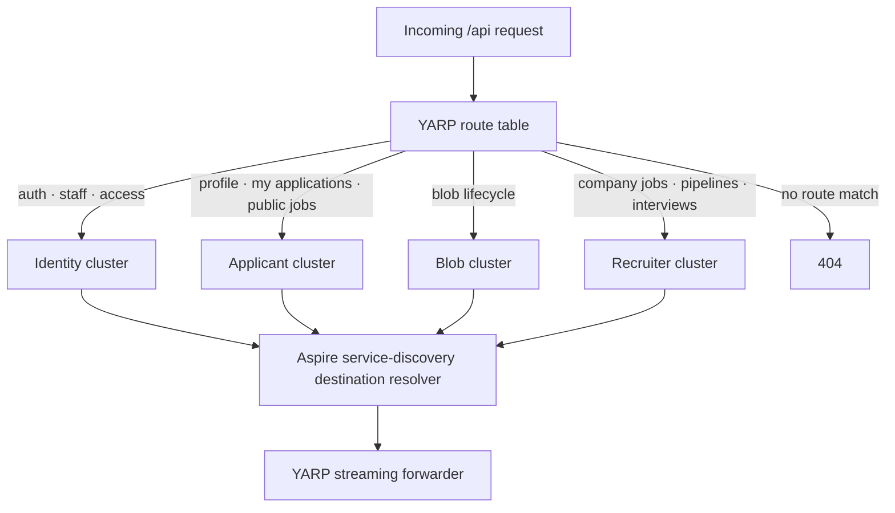

# Architecture And Runtime

Last updated: main@4ca0f29 | 2026-09-15

## Scope

This spec covers `HiringPlatform.slnx`, `Directory.Build.props`, `src/HiringPlatform.AppHost/`, `src/HiringPlatform.Gateway/`, bounded-service `Program.cs` files, `src/HiringPlatform.Api/` shared endpoint modules, `src/HiringPlatform.ServiceClients/`, and `src/HiringPlatform.ServiceDefaults/`.

Domain behavior belongs to the owning subsystem specs; database shape belongs to persistence/migration.

## Business Requirements

- A browser must have one stable `/api` origin while identity, applicant, and recruiter capabilities can scale independently.
- Identity sessions must remain valid across healthy replicas and bounded services.
- Public job discovery and authenticated candidate/recruiter actions must be routed without exposing internal service addresses.
- The API must not start serving against an uninitialized schema.
- Failure of one replica should permit Aspire service discovery to select another healthy replica; this does not guarantee bounded-context availability when all replicas fail.

## Runtime Topology

The request path is shown separately from startup orchestration so runtime traffic, deployment control, and persistence ownership do not overlap in one graph.



## Responsibility And Data Ownership

| Component | Owns | Current persistence boundary |
| --- | --- | --- |
| Gateway | Stable browser origin, route selection, forwarding, load balancing | None |
| Identity service | User/staff identity, authentication, access decisions | Shared PostgreSQL schema |
| Applicant service | Job discovery, applicant profiles, CV metadata, candidate application actions | Shared PostgreSQL schema |
| Recruiter service | Company jobs, pipelines, and interviews | Shared PostgreSQL schema |
| Blob service | Generic binary object lifecycle | Blob-owned MinIO/S3 objects and metadata |
| Migrator | Schema initialization and development seed | Writes PostgreSQL before services start |
| AppHost | Process orchestration, discovery, health dependencies, and replica count | None |

The service boxes are independent runtime deployments, but identity, applicant, and recruiter are not yet independent data or code bounded contexts. They reuse the same endpoint modules, application assembly, infrastructure assembly, and PostgreSQL schema. Blob storage is the first separately owned persistence boundary.

`Domain` is framework-free. `Application` owns CQRS requests, handlers, DTOs, ports, and ABAC enforcement. `Infrastructure` implements PostgreSQL repositories, clock, unit of work, and password hashing. API endpoint modules adapt HTTP to the mediator.

`HiringPlatform.Api` remains a monolithic host mapping all endpoint families, but Aspire currently exposes the gateway and bounded services instead. Startup ordering is documented independently below.

## Gateway Dispatch Flow



The gateway declares its route and cluster records programmatically in C# and supplies them to YARP with `LoadFromMemory`; there is no environment-specific JSON/YAML route file. Cluster destinations use Aspire logical addresses such as `https+http://applicant-service`, and `Microsoft.Extensions.ServiceDiscovery.Yarp` resolves them at runtime. YARP owns proxy header handling, cancellation, and streaming. Routes are explicit by method and path, and unmatched requests return 404 rather than falling through to a default bounded service.

## Startup And Availability Flow

```mermaid
sequenceDiagram
    participant Host as Aspire AppHost
    participant DB as PostgreSQL
    participant M as Migrator
    participant S as Bounded services
    participant G as Gateway
    participant W as Angular web

    Host->>DB: Start or reference hiringdb
    Host->>M: Start after database readiness
    M->>DB: Ensure schema; optionally seed local dev
    M-->>Host: Exit successfully
    Host->>S: Start two replicas per service after migrator completion
    S-->>Host: /health healthy
    Host->>G: Start after all service resources
    G-->>Host: /health healthy
    Host->>W: Start after gateway
```

Each service exposes `/health` and `/alive` through service defaults and OpenTelemetry instrumentation. The web is exposed on local port 4201. Internal HTTP addresses use Aspire service discovery.

## Shared Authentication Runtime

Identity, applicant, recruiter, and blob services use cookie name `hiring.session`, data-protection application name `Hirelane`, and shared key path `/tmp/hirelane-auth-keys`. This shared filesystem path permits each local process/replica to decrypt cookies issued by identity service. See identity/access/security for trust implications.

## Typed Service Clients

`HiringPlatform.ServiceClients` defines typed identity, applicant, and recruiter clients plus stable route constants. These clients are available for service-to-service use but are not registered or called by the current bounded service hosts; services currently share application/repository code and database access directly.

## Failure Behavior

- YARP propagates backend status and body and reports proxy transport failures using its standard error response.
- Unhandled service exceptions become generic 500 JSON; missing/invalid identity claims become 401.
- Gateway has no custom exception mapping, timeout response, circuit-breaker UI, or body-size limit.
- Startup is blocked if the migrator fails; this favors schema consistency over availability.
- A successful one-shot migrator completion allows all bounded services to start concurrently.

## Current Gaps

- Identity, applicant, and recruiter services share one PostgreSQL schema and the complete application/infrastructure assembly, so data and code ownership are not isolated; blob content is separately owned in MinIO.
- Gateway route ownership remains centralized at the edge and requires contract tests whenever the public API changes.
- Edge circuit breaking is not configured in YARP; service-to-service clients receive the standard HTTP resilience pipeline from `HiringPlatform.ServiceDefaults`.
- Shared data-protection keys use `/tmp`; durability and cross-host sharing are not production-ready.
- The monolithic `HiringPlatform.Api` and typed service clients overlap with the active bounded-service architecture.
- No distributed transaction, outbox, messaging, caching, rate limiting, or bounded-service contract versioning exists.
