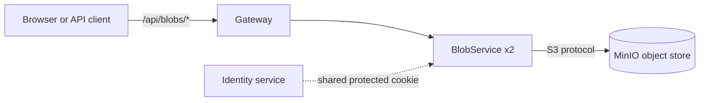
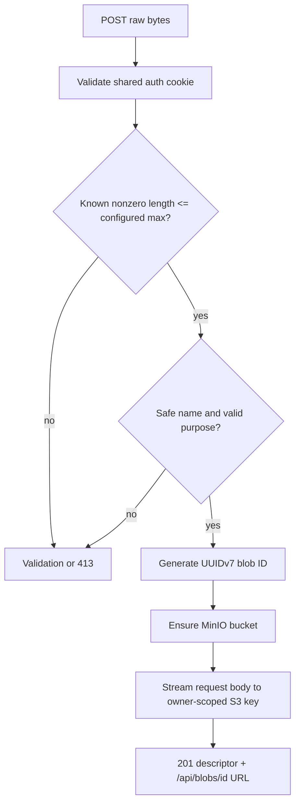
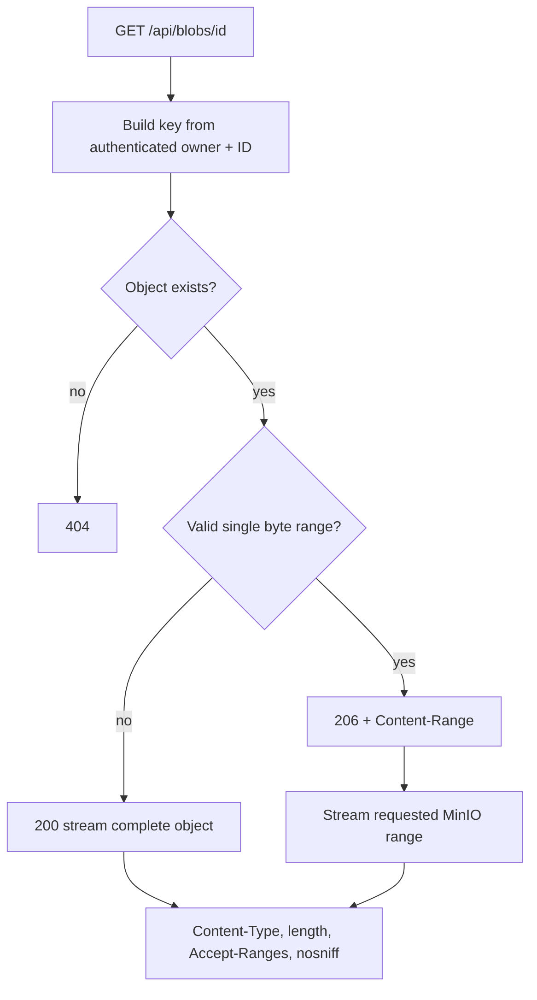

# Generic Blob Storage

Last updated: main@4ca0f29 | 2026-09-15

## Scope

This spec covers `src/HiringPlatform.BlobService/`, MinIO orchestration in `HiringPlatform.AppHost`, `/api/blobs` routing in `HiringPlatform.Gateway`, Angular blob client calls, and applicant-profile use of blob URLs.

## Business Requirements

- Binary storage must be a dedicated service rather than part of applicant, recruiter, or identity persistence.
- The contract must support generic documents, images, audio, video, and other configured attachment purposes; CV terminology must not appear in storage keys or routes.
- Uploads and downloads must stream rather than load an entire object into service memory.
- Media clients must be able to request byte ranges.
- Every object is owned by the authenticated user and must not be readable, inspected, or deleted by another user.
- Object names, content types, sizes, and business-neutral purpose labels must be retained as metadata.
- Active browser content must not be rendered inline by default.

## Service Topology

MinIO runs as an Aspire container with a persistent Docker volume. Blob service receives the S3 endpoint and local credentials through environment configuration. The bucket defaults to `hirelane-blobs` and is lazily created; concurrent replicas serialize initialization per process, while MinIO bucket creation remains idempotent.

## Generic Object Contract

| Operation | Route | Behavior |
| --- | --- | --- |
| Upload | `POST /api/blobs` | Streams raw request body into a generated owner-scoped object |
| Metadata | `HEAD /api/blobs/{id}` | Returns type, size, disposition, purpose, and range support |
| Stream | `GET /api/blobs/{id}` | Streams full object or one `bytes=start-end` range |
| Delete | `DELETE /api/blobs/{id}` | Deletes an object owned by the current user |

Upload headers are `Content-Type`, required `Content-Length`, required `X-Blob-Name`, and required `X-Blob-Purpose`. Purpose is a normalized 1–64 character label containing lowercase letters, digits, dots, underscores, or hyphens. It supports values such as `candidate-cv`, `portfolio-image`, `message-attachment`, or `interview-recording` without changing the service API.

Objects are keyed as `users/{ownerId}/{blobId}`. Original name and purpose are S3 user metadata. The generated ID is returned with name, content type, size, purpose, and same-origin URL. The default maximum size is 100 MiB and is configurable through `BlobStorage:MaximumBytes`.

## Upload Flow

YARP streams request bodies through the gateway to the blob service, which streams them to MinIO. The edge path therefore avoids buffering an entire upload in gateway memory.

## Download And Media Range Flow

PDF, image, audio, and video media can render inline unless `?download=true` is supplied. Other content types use attachment disposition. `X-Content-Type-Options: nosniff` is always set. Multi-range and suffix-range requests are not supported.

## Ownership And Security

The owner ID comes only from the authenticated name-identifier claim; clients cannot choose it. GET, HEAD, and DELETE construct an owner-scoped key, so another authenticated user receives 404 for the same public blob ID. MinIO is internal and objects are not public or presigned.

Content type is caller-declared and metadata is not malware scanning. The service intentionally accepts generic binary content; downstream consumers must impose purpose-specific type and size policy where required.

## Applicant CV Consumption

The applicant UI uploads a selected document with purpose `candidate-cv`, then adds the returned `/api/blobs/{id}` URL to the applicant profile. If profile linking fails, the UI attempts compensating blob deletion. Removing a linked profile CV updates the profile first and then attempts blob deletion. Existing absolute HTTPS links remain supported.

## Current Gaps

- Gateway and ingress request-size limits are not explicitly aligned with the blob service's configured upload limit.
- There is no multipart upload, resumable upload, checksum verification, virus scanning, content inspection, image transformation, lifecycle/retention rule, quota, deduplication, or encryption-key policy.
- Ownership is private-only; there are no grants, service identities, recruiter access, signed URLs, or application attachment authorization.
- Blob metadata has no PostgreSQL catalog, list/search API, reference count, or orphan cleanup job.
- Invalid/unsupported Range forms fall back to a full response instead of returning HTTP 416.
- Local MinIO credentials are source-defined development values; production secret injection is not implemented.
