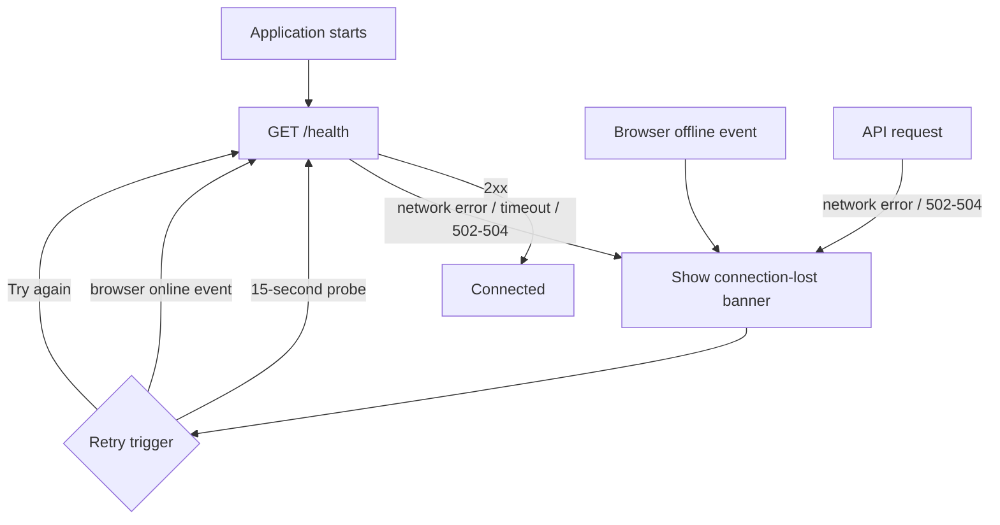
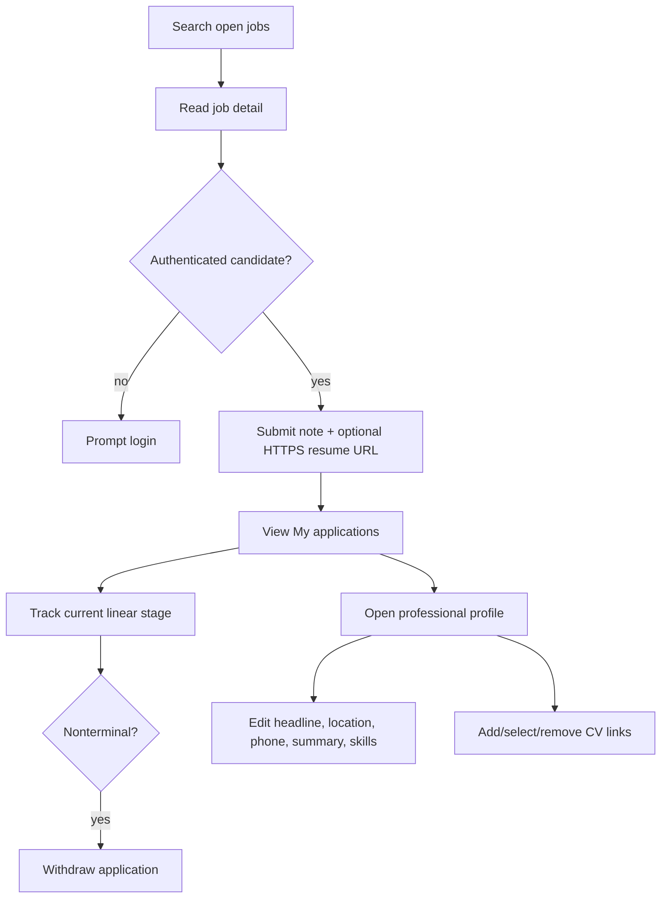
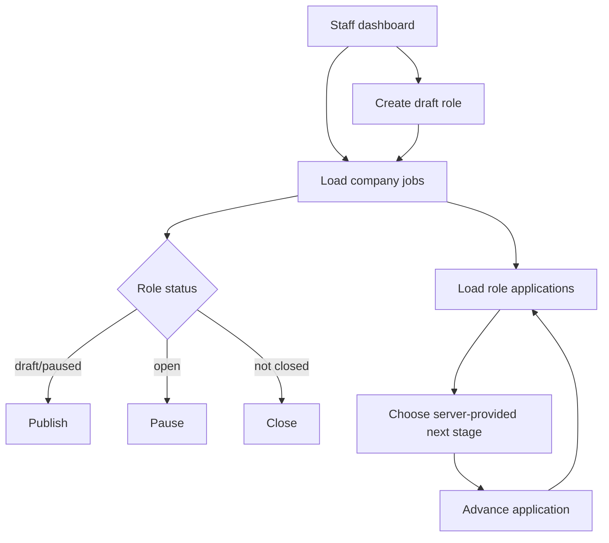

# Angular Frontend

Last updated: main@4ca0f29 | 2026-09-15

## Scope

This spec covers `src/hiring-web/src/app/`, `proxy.conf.js`, Angular routes/pages, `ApiService`, `AuthService`, guards, shared header, models, and browser-visible validation/error behavior.

## Business Requirements

- Visitors can discover open roles and view job detail without an account.
- Candidates can register/login, maintain a professional profile/CV links, apply, track applications, and withdraw.
- Company staff can register/login, create and control roles, view pipelines, and advance candidates.
- The browser must restore an existing cookie session before presenting identity-dependent navigation.
- The browser must visibly distinguish an unreachable server or offline device from an unauthenticated session.
- Client role checks improve navigation but never replace API authorization.

## Route Map

| Route | Surface | Browser guard |
| --- | --- | --- |
| `/` | Marketing home | None |
| `/jobs` | Public search/list | None |
| `/jobs/:id` | Job detail/apply prompt | None |
| `/login` | Login | None |
| `/register` | Candidate/company registration | None |
| `/dashboard` | Candidate or staff workspace | Auth guard |
| `/profile` | Applicant profile/CV library | Auth guard only; server requires candidate |

Unknown routes redirect home.

## Session Restoration And Navigation

```mermaid
sequenceDiagram
    participant Browser
    participant Auth as AuthService
    participant API
    participant Router

    Browser->>Auth: Application starts
    Auth->>API: GET /api/auth/me with cookie
    alt valid session
        API-->>Auth: User
        Auth->>Auth: user set; ready=true
    else 401
        API-->>Auth: Unauthorized
        Auth->>Auth: user=null; ready=true
    end
    Router->>Auth: Evaluate protected route
    Auth-->>Router: allow or redirect /login
```

`AuthService.staff` treats every role other than candidate as staff. Login/registration set user state immediately and navigate to `/dashboard`. Logout calls the API and clears local state.

## Connectivity Detection



`ConnectivityService` combines browser online/offline events, a five-second health timeout, periodic 15-second probes, and API interceptor failures. Authentication failures such as 401 do not mark the server disconnected. The banner remains visible across routes and offers an immediate retry.

## Candidate Journey



The profile page converts comma-separated skills to trimmed nonempty strings. Job detail allows a candidate to submit an application and displays a success/error message. It does not automatically use the profile primary CV.

## Staff Journey



The create form collects title, location, workplace, employment, description, and comma-separated skills. Salary and job editing are not exposed. Pipeline changes send no note. API-returned `nextStages` determines dropdown choices, but the aggregate revalidates transitions.

## Error And Validation Behavior

HTML constraints cover required fields, URLs, maxlengths, email type, and minimum password length. Server errors are mapped through `httpErrorMessage` on selected forms. Network failures and gateway availability responses (502, 503, and 504) also update the application-wide connectivity state. Several dashboard status, pipeline, primary-CV, and removal actions await calls without local try/catch, so errors may be unhandled and leave stale UI.

Angular enum strings depend on API camel-case enum serialization. Salary display assumes JPY and VND minor-unit divisor 1 and all other currencies divisor 100; this is presentation logic rather than a shared currency exponent model.

## Security And Personal Data

The browser receives user email, application candidate identity/email, cover letters, resume links, stage history, profile phone/skills/CV URLs, and interviewer identities where routes permit. None is persisted by frontend code to localStorage; session state is in memory and authentication uses an HttpOnly cookie. External CV links open with `noopener`.

## Current Gaps

- No interview scheduling, cancellation, feedback, job editing, salary entry, or staff-management UI exists despite backend APIs.
- The profile route browser guard checks authentication but not candidate role; server enforcement handles misuse.
- There is no route-level lazy loading, pagination control, automatic business-request retry, offline write queue, or unsaved-change protection.
- Several mutation actions lack disabled/busy states, confirmation, and error handling.
- Client models omit interview feedback even though backend DTOs can return it.
- Automated frontend coverage is limited to the generated app test and does not exercise product journeys.
