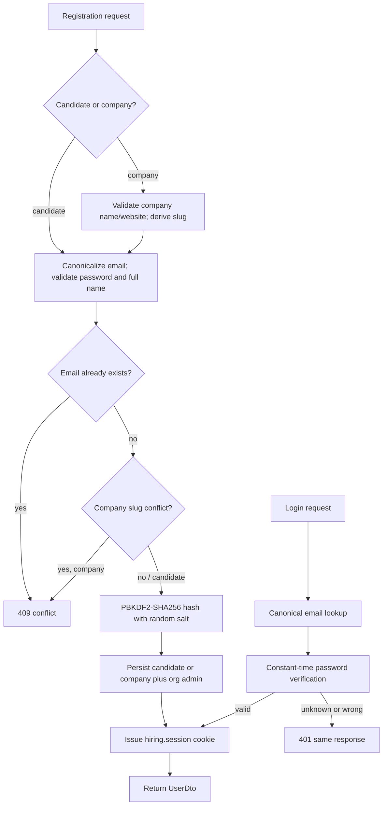
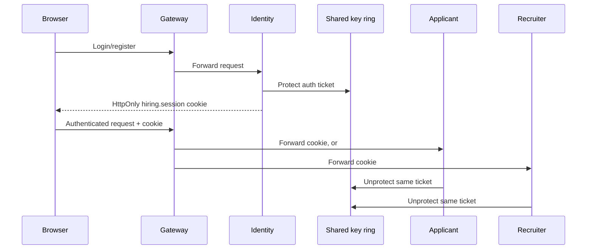
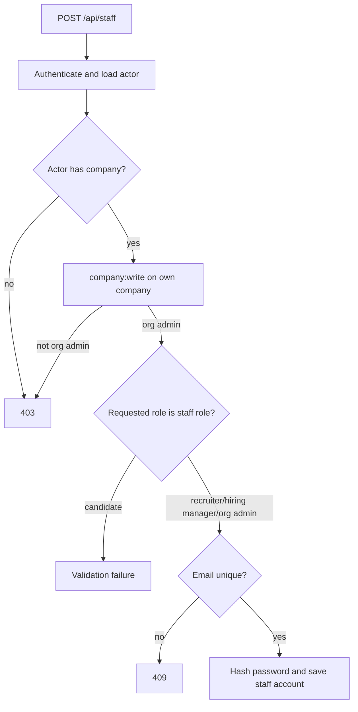
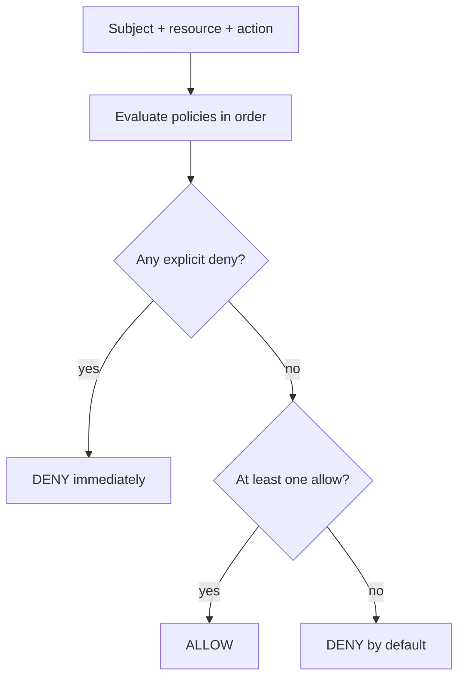

# Identity, Access, And Security

Last updated: main@4ca0f29 | 2026-09-15

## Scope

This spec covers `Domain/Identity/`, `Domain/Iam/`, `Application/Identity/Identity.cs`, `Application/Common/AccessGuard.cs`, API identity/access endpoints, `ApiSupport.cs`, `ApiConstants.cs`, identity service shared-cookie setup, and related gateway routes.

## Business Requirements

- A person may register as a candidate, or register a company and become its first organization administrator.
- Email identity is canonical and globally unique.
- Plaintext passwords must be validated before use, hashed before persistence, and never returned.
- Login must not reveal whether an email exists.
- An organization administrator may add hiring staff to only their own company.
- Authorization must be server-enforced with default deny and explicit-deny precedence; hidden UI controls are not security controls.
- Outsiders must not learn whether private jobs/applications exist where handlers intentionally return not found.

## Registration And Login

Candidate registration creates a `Role.Candidate` with no company. Company registration atomically adds a `Company` and first `Role.OrgAdmin`. Password policy currently requires at least 10 characters, one uppercase character, and one digit. User full names are required and limited to 120 characters. Company names are required, limited to 120, and must produce a nonempty unique slug; websites must be absolute HTTP(S) URLs.

Routes: `POST /api/auth/register/candidate`, `POST /api/auth/register/company`, `POST /api/auth/login`, authenticated `POST /api/auth/logout`, and authenticated `GET /api/auth/me`.

## Session Flow

Cookie settings are HttpOnly, SameSite=Lax, path `/`, and secure only when the request is secure. Claims include name identifier, name, email, and role. Service authorization uses the identifier to reload the current user, so stale/deleted users are rejected even if a cookie decrypts.

## Staff Provisioning

`GET /api/staff` allows company staff to list their company directory. `POST /api/staff` is restricted by `CompanyWrite`, which explicitly allows only organization admins.

## ABAC Decision Model

Policies enforce service-account read-only access; candidate prohibition on advancing their own application or scheduling its interview; owner access; same-company staff management; candidate application to public jobs; and narrow public job/company reads. Access actions are a closed set parsed from codes.

`POST /api/access/evaluate` accepts caller-supplied normalized resource attributes and evaluates them for the authenticated actor. It is a policy decision endpoint, not proof that supplied ownership attributes are true. Resource-owning handlers construct attributes from stored aggregates and remain the authoritative enforcement points.

## Data And Security Requirements

- Email, full name, company association, and roles are personal/account data.
- Password hashes are PBKDF2-SHA256 with 210,000 iterations, random 128-bit salt, and 256-bit derived key; verification is fixed-time.
- Unknown email and invalid password return the same unauthorized result.
- Passwords/hashes are excluded from DTOs, claims, and normal logs.
- Domain exceptions become validation results; API validation errors use a `request` key.
- Authorization denials generally return 403; selected private-resource reads return 404 to hide existence.

## Current Gaps

- There is no email verification, password reset/change, MFA, account disable/delete, session revocation, or session expiry policy documented in code.
- There is no CSRF token/antiforgery enforcement, login throttling, lockout, rate limiting, or audit log.
- `SecurePolicy.SameAsRequest` permits an insecure cookie on HTTP and is suitable only for local development unless TLS is enforced upstream.
- The shared key path is temporary local storage and not a production multi-host key-ring solution.
- The access-evaluation endpoint trusts resource attributes supplied by its authenticated caller and must not independently authorize a resource mutation.
- Roles have no lifecycle or least-privilege management after account creation; an org admin can create another org admin.
