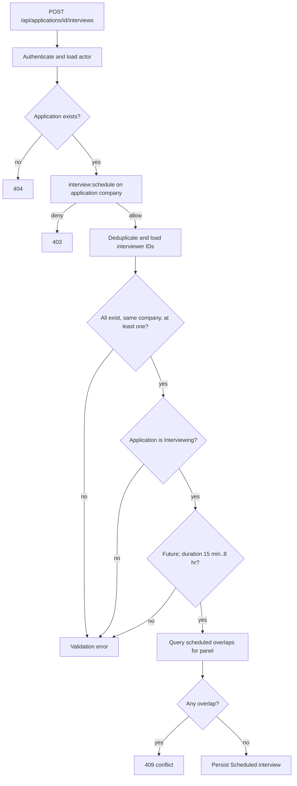
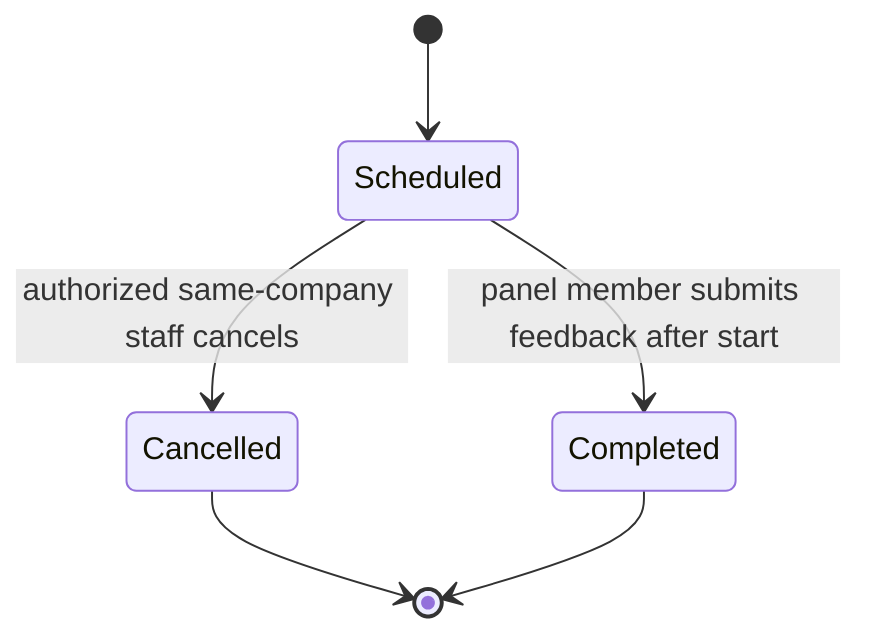
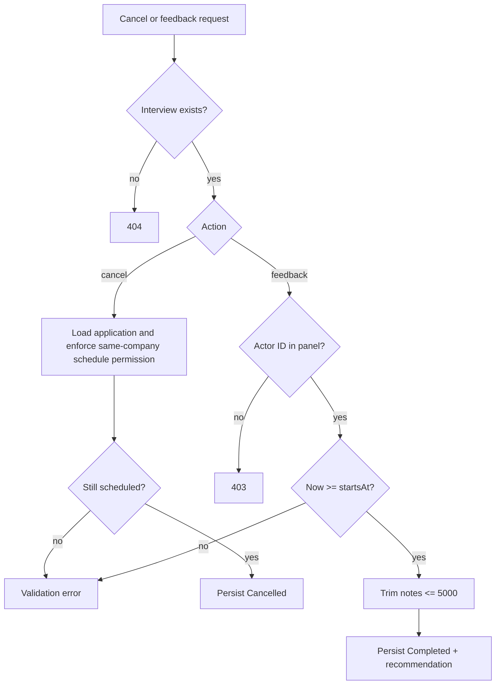
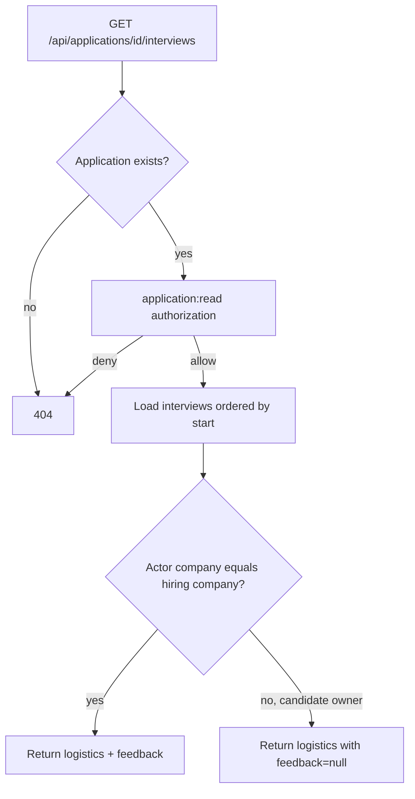

# Interviews And Feedback

Last updated: main@4ca0f29 | 2026-09-15

## Scope

This spec covers `Domain/Interviews/Interview.cs`, `Application/Interviews/Interviews.cs`, interview endpoints, recruiter service ownership, interview persistence/query behavior, and exposed Angular client methods/models.

## Business Requirements

- Interviews may be scheduled only for applications currently in `Interviewing` stage.
- Only same-company staff may schedule/cancel interviews for their applications.
- Every interview requires at least one distinct interviewer from the hiring company.
- A panel member must not have overlapping scheduled interviews.
- Only a listed panel member may submit feedback, and not before the interview starts.
- Candidate viewers may see interview logistics but not internal feedback.
- Scheduled interviews can become either completed or cancelled and cannot transition again.

## Schedule Flow

Interview kinds are phone, video, on-site, and technical. Start time is normalized to UTC. Boundary-touching interviews do not overlap because overlap uses half-open intervals (`start < otherEnd` and `otherStart < end`).

## Interview State And Actions

Recommendations are strong-no, no, yes, and strong-yes. One feedback object completes the interview; there is no independent feedback per panel member.

## List And Visibility Flow

Interviewer DTOs include user IDs and names. Candidate-facing responses therefore reveal panel identity. The Angular API service exposes interview listing, but current pages do not render scheduling, cancellation, or feedback controls and do not expose mutation client methods.

## Concurrency Requirements

The handler checks panel conflicts before insert. This is not protected by a database exclusion constraint or serializable transaction, so concurrent scheduling requests can both pass and create overlaps. Cancelled interviews no longer block a slot; completed interviews are also excluded from conflict queries because only scheduled rows are considered.

## Current Gaps

- No calendar invitations, conferencing links, rooms, timezones, reminders, rescheduling, or attendee availability exist.
- Conflict prevention is race-prone and has no database-level temporal constraint.
- Feedback supports only one completing submission rather than one per interviewer and has no edit/audit flow.
- Candidates can see interviewer names; no explicit privacy/product decision documents whether that is intended.
- There is no rule linking interview completion to application-stage advancement.
- The Angular UI does not implement interview management despite backend endpoints.
