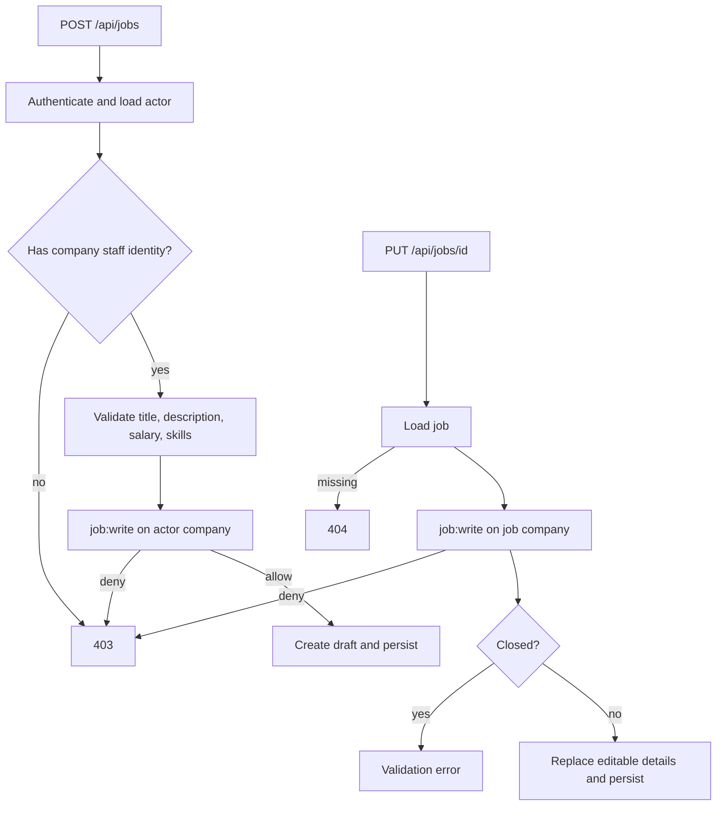
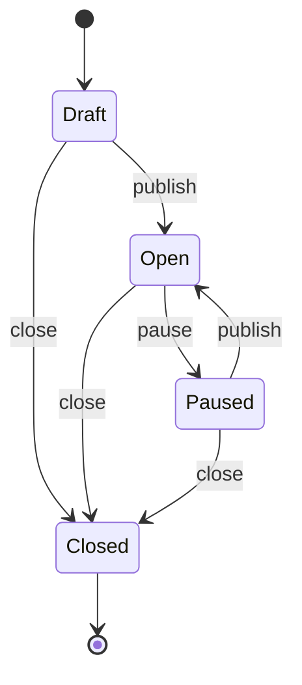
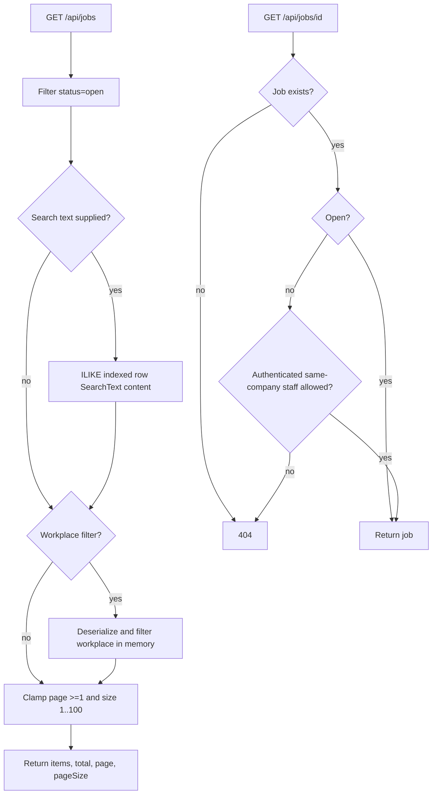
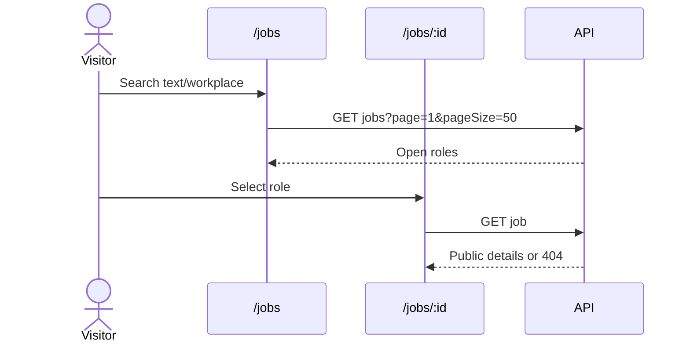

# Jobs And Public Discovery

Last updated: main@4ca0f29 | 2026-09-15

## Scope

This spec covers `Domain/Jobs/Job.cs`, `Application/Jobs/Jobs.cs`, job endpoint modules, applicant/recruiter service route ownership, gateway job dispatch, job repository behavior, and Angular jobs, job-detail, and staff-dashboard surfaces.

## Business Requirements

- Company staff may create jobs only for their own company.
- New jobs begin as drafts and cannot accept applications until published.
- Public discovery exposes only open jobs.
- Draft, paused, and closed job existence must be hidden from anonymous users and unrelated users.
- Company staff may list and manage all jobs belonging to their own company.
- Job status changes must follow the lifecycle and closed jobs are immutable.
- Search must support text, workplace filtering, bounded pagination, and newest-first presentation.

## Create And Edit Flow

Title is required and limited to 150 characters; description is limited to 20,000. Location is trimmed. Skills are normalized. Salary uses minor units, requires one supported currency, and requires minimum not greater than maximum. Employment values are full-time, part-time, contract, or internship; workplace values are on-site, hybrid, or remote.

## Status Lifecycle

`POST /api/jobs/{id}/status` requires `job:publish` for same-company staff. The first publication sets `PublishedAt`; republishing a paused job preserves it. Closing sets `ClosedAt`. Open alone means public and accepts applications.

## Search And Detail Flow

Search text covers title, description, location, and skills through the denormalized `SearchText` column. Results are ordered by descending version-7-like identifier rather than an explicit publication timestamp. Company names are joined through repository lookups when mapping DTOs.

Applicant service owns public GET job routes; recruiter service owns company listing and mutations. The gateway distinguishes public detail from `/applications` suffixes with method/path rules.

## User Interface Flow

The staff dashboard creates drafts and offers publish/pause/close actions according to displayed status. The API remains authoritative if UI state is stale.

## Current Gaps

- The Angular client has no job-edit form and does not collect salary when creating a role.
- Workplace filtering and pagination happen after loading/deserializing all matching open rows, limiting scale.
- Text search uses a broad `ILIKE` expression with no PostgreSQL full-text/trigram index.
- Repository ordering by ID assumes ID chronology and does not explicitly order by publication date.
- There is no job deletion, reopening after close, expiry, approval workflow, department, timezone, or application deadline.
- Concurrent edits/status changes have no row version and can overwrite one another.
