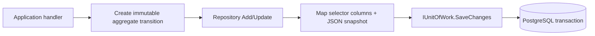
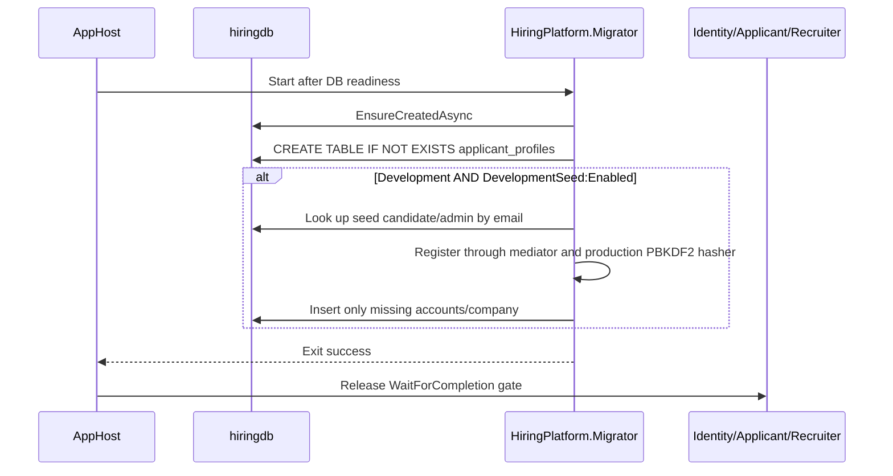

# Persistence, Migration, And Development Seed

Last updated: main@4ca0f29 | 2026-09-15

## Scope

This spec covers `Infrastructure/Persistence/HiringDbContext.cs`, `Repositories.cs`, `InfrastructureServices.cs`, `HiringPlatform.Migrator/`, AppHost database/migrator orchestration, and PostgreSQL configuration.

## Business Requirements

- Domain aggregates own invariants and serialization snapshots; persistence adapters must reconstruct those aggregates without bypassing their value types.
- Searchable and relational selectors must have dedicated columns/indexes rather than requiring JSON scans.
- Schema initialization must complete before serving traffic.
- Development accounts must be local opt-in only, idempotent by canonical email, and use the same password hashing path as ordinary registration.
- Production credentials and plaintext passwords must never be persisted or logged.

## Storage Model

| Table | Key/indexed selectors | Snapshot contents |
| --- | --- | --- |
| `users` | `Id`, unique `Email`, `CompanyId` index | Complete `UserSnapshot`, including password hash |
| `companies` | `Id`, unique `Slug` | Complete `CompanySnapshot` |
| `jobs` | `Id`, `CompanyId`, `Status`, denormalized `SearchText` | Complete `JobSnapshot` |
| `applicant_profiles` | `CandidateId` | Complete `CandidateProfileSnapshot` |
| `applications` | `Id`, `JobId`, `CandidateId`, unique job/candidate, stage | Complete `ApplicationSnapshot` |
| `interviews` | `Id`, `ApplicationId`, company/status/time/panel selectors | Complete `InterviewSnapshot` |

Snapshots are JSONB serialized with web JSON defaults. Repositories deserialize through aggregate `FromSnapshot` methods. Add/update operations write both selector columns and the complete snapshot. Query reads are no-tracking.

## Repository Write Flow

A handler normally performs one `SaveChanges`, so all tracked writes in that handler are atomic. Company registration adds company and first admin in one unit of work. There is no cross-request or cross-service transaction.

## One-Shot Migrator Flow

The migrator is a console process and exits after schema/optional seed completion. Aspire starts one migrator resource per AppHost run; idempotency makes repeated local AppHost runs safe, but this is not a globally coordinated exactly-once guarantee across multiple orchestrators.

## Development Seed Contract

Seeding requires both `DOTNET_ENVIRONMENT=Development` and `DevelopmentSeed:Enabled=true`. The opt-in is set by the local AppHost launch profile and forwarded only when AppHost itself is in Development. Seed candidate and organization-admin credentials are documented in the root README for local use.

The seeder calls `RegisterCandidate` and `RegisterCompany`; therefore passwords pass `PlainPassword` validation and `Pbkdf2PasswordHasher`. Stored hashes use `pbkdf2-sha256$210000$<salt>$<key>` with random salt. Existing email records are not overwritten. A missing admin with an already occupied company slug causes migrator failure rather than mutating unknown data.

## Read And Query Behavior

- Job open/text filtering runs in PostgreSQL; workplace filtering and pagination run after deserialization.
- Application lists are ordered by descending ID.
- Interview lists are ordered by start time; overlap lookup filters scheduled rows and time range in SQL, then panel intersection in memory.
- DTO mapping performs batched `FindMany` calls for related companies/users/jobs, avoiding one query per item but not database joins.

## Recovery And Failure Behavior

Schema or seed failure exits the migrator unsuccessfully and keeps dependent services blocked. Repository/database exceptions are not generally translated by the mediator because it catches domain exceptions only; unexpected persistence errors become API 500 responses.

## Current Gaps

- `EnsureCreated` plus hand-written `CREATE TABLE IF NOT EXISTS` is not versioned schema migration and cannot safely evolve existing columns/indexes.
- Aggregate snapshots have no schema version or migration strategy.
- No optimistic concurrency tokens protect immutable read-modify-write transitions from lost updates.
- All bounded services directly share tables and database credentials.
- There is no backup/restore, retention, encryption-at-rest, row-level security, outbox, read replica, or production secret-management contract.
- The seed company/email partial-state case can block startup, and seed execution is per AppHost run rather than globally leased.
