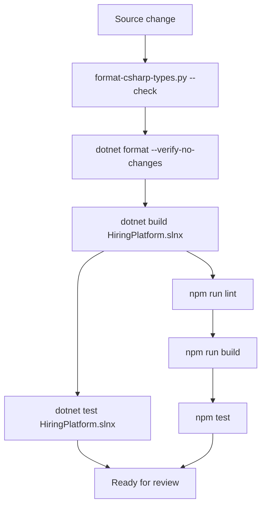
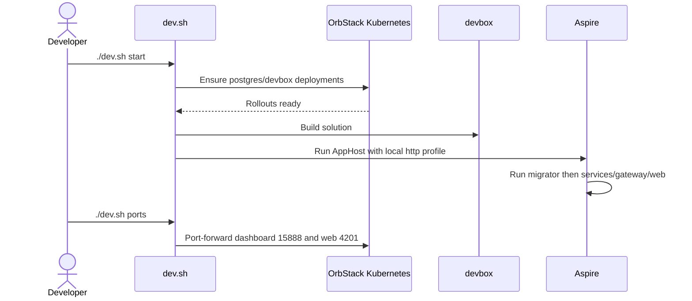

# Testing And Development Operations

Last updated: main@4ca0f29 | 2026-09-15

## Scope

This spec covers `tests/`, `scripts/lint.sh`, `scripts/format-csharp-types.py`, `dev.sh`, `.devcontainer/`, project build settings, Angular package scripts, Aspire launch settings, and documented validation commands.

## Quality Requirements

- All .NET projects compile with nullable analysis, latest recommended analyzers, code style enforcement, and warnings as errors.
- Domain invariants and authorization decisions require executable tests independent of HTTP/UI.
- C# declaration formatting and `dotnet format` must be clean before integration.
- The Angular application must lint, build under strict TypeScript, and run tests.
- Local startup must be restart-safe, initialize persistence before traffic, and not require production credentials.

## Validation Flow

Root README commands execute inside the OrbStack development pod. `scripts/lint.sh` checks C# custom formatting and `dotnet format`, then Angular lint; it does not run builds or tests.

## Current Domain Test Coverage

`tests/HiringPlatform.Domain.Tests/DomainTests.cs` covers:

- canonical email and invalid email;
- money currency mismatch;
- job closed-state transition rejection;
- application stage-skip rejection;
- one-primary-CV behavior and insecure CV URL rejection;
- explicit candidate self-advance deny overriding owner allow;
- same-company staff allow and cross-company deny.

These are pure domain/policy tests. No current tests execute application handlers, repositories, PostgreSQL, migrator, Minimal API endpoints, shared cookies, gateway dispatch, service discovery, multiple replicas, or Angular product flows.

## Local Runtime Flow

Kubernetes PVCs retain PostgreSQL and package caches. Host source is mounted into the Linux pod. `start` is idempotent for a running AppHost process; `stop`, `logs`, `shell`, `exec`, `rebuild`, and `down` provide lifecycle operations.

The local AppHost profile sets Development and explicitly enables development seed. Seed credentials are local-only and documented in README. Migrator startup gates bounded services.

## Operational Boundaries

OpenTelemetry captures logs, ASP.NET Core/HTTP tracing, runtime metrics, and OTLP export when configured. Health endpoints distinguish general health (`/health`) and liveness (`/alive`). The active architecture runs two replicas each for identity, applicant, and recruiter services.

## Current Gaps

- There is no CI workflow checked into the repository.
- There are no application, persistence integration, API contract, gateway routing, cookie interoperability, migration, load-balancing, failure-injection, or end-to-end tests.
- PostgreSQL `EnsureCreated` is prototype-only and has no migration rollback/forward test.
- Local development depends on OrbStack Kubernetes and hard-coded namespace/service details.
- No load, security, accessibility, browser-matrix, backup/restore, or deployment smoke tests exist.
- `scripts/lint.sh` omits builds/tests, so one command does not enforce the full quality contract.
